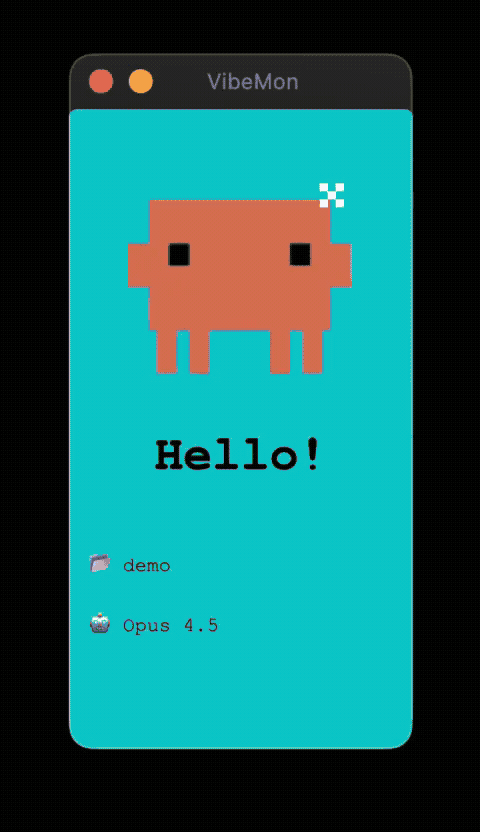

# Vibe Monitor

[](https://www.npmjs.com/package/vibe-monitor)
[](https://www.npmjs.com/package/vibe-monitor)
[](https://github.com/nalbam/vibe-monitor/blob/main/LICENSE)

**Real-time status monitor for AI coding assistants with pixel art character display.**

See at a glance what your AI coding assistant is doing — thinking, writing code, or waiting for input. A cute pixel art character visually represents the current state.

## Supported Tools

| Tool | Description |
|------|-------------|
| **[Claude Code](https://docs.anthropic.com/en/docs/claude-code)** | Anthropic's official AI coding assistant |
| **[Kiro](https://kiro.dev/)** | AWS's AI coding assistant |

## What It Monitors

| Field | Description | Example |
|-------|-------------|---------|
| **State** | Current activity state | `working`, `idle`, `notification` |
| **Project** | Active project directory | `vibe-monitor` |
| **Tool** | Currently executing tool | `Bash`, `Read`, `Edit` |
| **Model** | Active model | `Opus 4.5`, `Sonnet` |
| **Memory** | Context window usage | `45%` |

## Platforms

| Platform | Description | Best For |
|----------|-------------|----------|
| **Desktop App** | Electron app with system tray | Daily use, always-visible monitoring |
| **Web Simulator** | Browser-based preview | Testing, development, no installation |
| **ESP32 Hardware** | Dedicated LCD display device (experimental) | Desk companion, hardware enthusiasts |

> **Note:** ESP32 hardware support is experimental and not fully tested.

## Preview



```
┌────────────────────┐
│                    │
│    ┌──────────┐    │
│    │██████████│    │
│  ██│█ ■    ■ █│██  │  ← Claude character
│    │██████████│    │     (128x128 pixels)
│    └─┬─┬──┬─┬─┘    │
│      │█│  │█│      │
├────────────────────┤
│     Working        │  ← Status text
│     ● ● ● ○        │  ← Loading animation
├────────────────────┤
│ 📂 my-project      │  ← Project name
│ 🛠️ Bash            │  ← Current tool
│ 🤖 Opus 4.5        │  ← Model
│ 🧠 45%             │  ← Memory usage
│ ████████░░░░░░░░░░ │  ← Memory bar (gradient)
└────────────────────┘
```

## Prerequisites

The hook scripts require Python 3 (included in macOS and most Linux distributions).

| Tool | Required For | macOS | Ubuntu/Debian | Alpine |
|------|--------------|-------|---------------|--------|
| **Python 3** | Hook scripts (required) | Built-in | Built-in | `apk add python3` |
| **Node.js** | Desktop App only | `brew install node` | `apt install nodejs npm` | `apk add nodejs npm` |

### Quick Check

```bash
# Verify Python 3 is installed
python3 --version
```

> **Note:** `stty` (for ESP32 serial) is included in all Unix systems.

## Quick Start

### Desktop App

```bash
cd desktop
npm install
npm start
```

The app runs in the system tray and listens on `http://127.0.0.1:19280`.

### Web Simulator

No installation required - just open in browser:

**Online**: https://nalbam.github.io/vibe-monitor/simulator/

**Local**:
```bash
open simulator/index.html
```

### ESP32 Hardware (Experimental)

See [ESP32 Setup](#esp32-setup-experimental) section below.

## Integration

Vibe Monitor receives status updates from AI coding assistants through their hook systems.

### Supported Tools

| Tool | Hook System |
|------|-------------|
| **Claude Code** | Shell hooks via `~/.claude/settings.json` |
| **Kiro** | Agent hooks via `~/.kiro/hooks/` |

### How It Works

```
AI Coding Assistant → Hooks → Vibe Monitor
         │                         │
         └── Events ─────────────→ Display
             (state, tool,         (Desktop App,
              project, etc.)        ESP32, or both)
```

---

### Claude Code Setup

Claude Code uses **hooks** and **statusline** to send data to Vibe Monitor.

| Source | Data Provided | JSON Fields |
|--------|---------------|-------------|
| **Hook** | state, event, tool, project | `.hook_event_name`, `.tool_name`, `.cwd` |
| **Statusline** | model, memory | `.model.display_name`, `.context_window.used_percentage` |

#### 1. Copy scripts

```bash
# Create hooks directory
mkdir -p ~/.claude/hooks

# Copy hook script (provides state, tool, project)
cp config/claude/hooks/vibe-monitor.py ~/.claude/hooks/
chmod +x ~/.claude/hooks/vibe-monitor.py

# Copy statusline script (provides model, memory)
cp config/claude/statusline.py ~/.claude/statusline.py
chmod +x ~/.claude/statusline.py
```

#### 2. Configure environment variables

Choose **one** of the following options:

**Option A: Copy to config folder (recommended)**

The hook script automatically loads `~/.claude/.env.local`:

```bash
cp config/claude/.env.sample ~/.claude/.env.local
# Edit the file and set your values
```

**Option B: Source from shell profile**

Add to `~/.zshrc` or `~/.bashrc`:

```bash
if [ -f ~/.claude/.env.local ]; then
  source ~/.claude/.env.local
fi
```

Then copy the sample file:

```bash
cp config/claude/.env.sample ~/.claude/.env.local
```

#### 3. Edit `~/.claude/.env.local`

```bash
# Debug mode (optional, 1: enabled, 0: disabled)
# export DEBUG=1

# Cache file for project metadata (model, memory) - optional
# Default: ~/.claude/statusline-cache.json
# export VIBE_MONITOR_CACHE="~/.claude/statusline-cache.json"

# Desktop App URL (auto-launches via npx if not running)
export VIBE_MONITOR_URL="http://127.0.0.1:19280"

# ESP32 USB Serial port (optional)
export ESP32_SERIAL_PORT="/dev/cu.usbmodem1101"

# ESP32 WiFi HTTP (optional)
# export ESP32_HTTP_URL="http://192.168.1.100"
```

> **Note:** Character is auto-detected (Claude Code → `clawd`)

#### 4. Register in `~/.claude/settings.json`

Add both hooks and statusline configuration:

```json
{
  "hooks": {
    "SessionStart": [{ "command": "python3 ~/.claude/hooks/vibe-monitor.py" }],
    "UserPromptSubmit": [{ "command": "python3 ~/.claude/hooks/vibe-monitor.py" }],
    "PreToolUse": [{ "command": "python3 ~/.claude/hooks/vibe-monitor.py" }],
    "Notification": [{ "command": "python3 ~/.claude/hooks/vibe-monitor.py" }],
    "Stop": [{ "command": "python3 ~/.claude/hooks/vibe-monitor.py" }]
  },
  "statusLine": {
    "type": "command",
    "command": "python3 ~/.claude/statusline.py"
  }
}
```

#### 5. Statusline Display

Claude Code statusline shows project, model, and memory usage:

```
📂 vibe-monitor │ 🤖 Opus 4.5 │ 🧠 ━━━━━━━━╌╌ 80%
```

The statusline also sends model and memory data to Vibe Monitor in the background.

#### Claude Code Hook Events

| Event | Vibe Monitor State | Description |
|-------|-------------------|-------------|
| `SessionStart` | `start` | Session begins |
| `UserPromptSubmit` | `thinking` | User submits prompt, AI starts thinking |
| `PreToolUse` | `working` | Tool execution starts |
| `Notification` | `notification` | User input needed |
| `Stop` | `done` | Agent turn ends |

> **Note:** `PostToolUse` event is not processed.

---

### Kiro Setup

Kiro uses `.kiro.hook` files that call the `vibe-monitor.py` script.

#### 1. Copy scripts

```bash
# Create hooks directory
mkdir -p ~/.kiro/hooks

# Copy hook script (main logic)
cp config/kiro/hooks/vibe-monitor.py ~/.kiro/hooks/
chmod +x ~/.kiro/hooks/vibe-monitor.py

# Copy hook files (event triggers)
cp config/kiro/hooks/*.kiro.hook ~/.kiro/hooks/
```

#### 2. Configure environment (Optional)

```bash
cp config/kiro/.env.sample ~/.kiro/.env.local
```

Edit `~/.kiro/.env.local`:

```bash
# Debug mode (optional, 1: enabled, 0: disabled)
# export DEBUG=1

# Desktop App URL (auto-launches via npx if not running)
export VIBE_MONITOR_URL="http://127.0.0.1:19280"

# ESP32 USB Serial port (optional)
export ESP32_SERIAL_PORT="/dev/cu.usbmodem1101"

# ESP32 WiFi HTTP (optional)
# export ESP32_HTTP_URL="http://192.168.1.100"
```

> **Note:** Character is auto-set to `kiro` in the hook script.

#### Kiro Hook Events

| Hook File | Event | State | Description |
|-----------|-------|-------|-------------|
| `vibe-monitor-agent-spawn.kiro.hook` | `agentSpawn` | `start` | Agent activated |
| `vibe-monitor-prompt-submit.kiro.hook` | `promptSubmit` | `thinking` | User submits prompt |
| `vibe-monitor-pre-tool-use.kiro.hook` | `preToolUse` | `working` | Tool execution starts |
| `vibe-monitor-agent-stop.kiro.hook` | `agentStop` | `done` | Agent turn ends |

#### Available Kiro Event Types

`agentSpawn`, `promptSubmit`, `preToolUse`, `postToolUse`, `agentStop`, `fileCreated`, `fileSaved`, `fileDeleted`

---

### Hook Priority

The hook sends status updates in order (only if configured):
1. **Desktop App** - if `VIBE_MONITOR_URL` is set (auto-launches via `npx vibe-monitor`)
2. **ESP32 USB Serial** - if `ESP32_SERIAL_PORT` is set
3. **ESP32 HTTP** - if `ESP32_HTTP_URL` is set

---

### Event Mapping Comparison

| Action | Claude Code | Kiro | State |
|--------|-------------|------|-------|
| Session start | `SessionStart` | `agentSpawn` | `start` |
| User input | `UserPromptSubmit` | `promptSubmit` | `thinking` |
| Before tool | `PreToolUse` | `preToolUse` | `working` |
| Agent done | `Stop` | `agentStop` | `done` |
| Notification | `Notification` | - | `notification` |

> **Note:** `PostToolUse` / `postToolUse` events are not used. The `done` state auto-transitions to `idle` after 1 minute of inactivity.

## Characters

| Character | Color | Description | Auto-selected for |
|-----------|-------|-------------|-------------------|
| `clawd` | Orange | Default character with arms and legs | Claude Code |
| `kiro` | White | Ghost character with wavy tail | Kiro |

Character is **auto-detected** based on the IDE hook events. You can also manually change it via the system tray menu.

## State Display

| State | Background | Eyes | Text | Trigger |
|-------|------------|------|------|---------|
| `start` | Cyan | ■ ■ + ✦ | Hello! | Session begins |
| `idle` | Green | ■ ■ | Ready | Waiting for input |
| `thinking` | Purple | ▀ ▀ + 💭 | Thinking | User submits prompt |
| `planning` | Teal | ▀ ▀ + 💭 | Planning | Plan mode active |
| `working` | Blue | 🕶️ (sunglasses) | (tool-based) | Tool executing |
| `notification` | Yellow | ● ● + ? | Input? | User input needed |
| `done` | Green | > < | Done! | Tool completed |
| `sleep` | Navy | ─ ─ + Z | Zzz... | 5min inactivity |

### Working State Text

The `working` state displays context-aware text based on the active tool:

| Tool | Possible Text |
|------|---------------|
| Bash | Running, Executing, Processing |
| Read | Reading, Scanning, Checking |
| Edit | Editing, Modifying, Fixing |
| Write | Writing, Creating, Saving |
| Grep | Searching, Finding, Looking |
| Glob | Scanning, Browsing, Finding |
| Task | Thinking, Working, Planning |
| WebFetch | Fetching, Loading, Getting |
| WebSearch | Searching, Googling, Looking |
| Default | Working, Busy, Coding |

### Animations

- **Floating**: All states have gentle floating motion (±3px horizontal, ±5px vertical, ~3.2s cycle)
- **Blink**: Idle state blinks every 3 seconds
- **Loading dots**: Thinking/working states show animated progress dots (thinking is 3x slower)
- **Matrix rain**: Working state shows movie-style falling green code effect
  - Flickering white/green head
  - Gradient tail (white → bright → mid → dim → dark)
  - Variable speed streams (1-6, mixing slow and fast)
  - 70% stream density
- **Sunglasses**: Working state character wears Matrix-style dark green sunglasses
- **Sparkle**: Session start shows rotating sparkle effect
- **Thought bubble**: Thinking state shows animated thought bubble
- **Zzz**: Sleep state shows blinking Z animation

### State Timeout

All platforms (Desktop, Simulator, ESP32) automatically transition between states:

| From State | Timeout | To State |
|------------|---------|----------|
| `start`, `done` | 1 minute | `idle` |
| `idle`, `notification` | 5 minutes | `sleep` |

Any new status update resets the timeout timer and wakes the display from sleep.

**Desktop only:** After 10 minutes in sleep state, the window automatically closes. It will reopen when new status updates arrive.

### Special Behaviors

- **Memory hidden on start**: Memory usage is not displayed during the `start` state for a cleaner welcome screen
- **Project change resets data**: When switching to a different project, model and memory values are automatically cleared

## Project Lock

Lock the monitor to a specific project to prevent display updates from other projects.

### Features

- **Lock modes**: Two auto-lock strategies available (default: `on-thinking`)
- **Project list**: All incoming projects are tracked (Desktop: unlimited, ESP32: max 10)
- **Tray menu**: Easily switch or unlock via "Project Lock" submenu
- **API control**: Lock/unlock via HTTP API or ESP32 serial commands
- **State reset**: Lock change transitions state to `idle`

### Lock Modes

| Mode | Description |
|------|-------------|
| `first-project` | First incoming project is automatically locked |
| `on-thinking` | Lock when entering thinking state (default) |

### Tray Menu (Desktop)

```
Project: vibe-monitor 🔒
─────────────
Project Lock →
  ├─ Lock Mode →
  │   ├─ ○ First project auto-lock
  │   └─ ● Lock on thinking state
  ├─ ─────────────
  ├─ 🔒 vibe-monitor     (currently locked)
  ├─ ○ another-project
  └─ ─────────────
     Unlock
```

### CLI (vibe-lock skill)

```bash
# Lock current project
curl -s -X POST http://127.0.0.1:19280/lock \
  -H "Content-Type: application/json" \
  -d "{\"project\":\"$(basename $(pwd))\"}"

# Unlock
curl -s -X POST http://127.0.0.1:19280/unlock
```

### CLI (Python script)

The hook script also supports direct CLI commands:

```bash
# Lock current project
python3 ~/.claude/hooks/vibe-monitor.py --lock

# Lock specific project
python3 ~/.claude/hooks/vibe-monitor.py --lock my-project

# Unlock
python3 ~/.claude/hooks/vibe-monitor.py --unlock

# Get current status
python3 ~/.claude/hooks/vibe-monitor.py --status

# Get current lock mode
python3 ~/.claude/hooks/vibe-monitor.py --lock-mode

# Set lock mode
python3 ~/.claude/hooks/vibe-monitor.py --lock-mode on-thinking
python3 ~/.claude/hooks/vibe-monitor.py --lock-mode first-project
```

## HTTP API

Both Desktop App (port 19280) and ESP32 WiFi mode (port 80) support the same API.

> **Note:** Desktop App has a 10KB payload size limit for security.

### POST /status

Update monitor status.

```bash
curl -X POST http://127.0.0.1:19280/status \
  -H "Content-Type: application/json" \
  -d '{"state":"working","tool":"Bash","project":"my-project","model":"opus","memory":"45%"}'
```

**Request Body:**
```json
{
  "state": "working",
  "event": "PreToolUse",
  "tool": "Bash",
  "project": "my-project",
  "model": "opus",
  "memory": "45%",
  "character": "clawd"
}
```

### GET /status

Get current status.

```bash
curl http://127.0.0.1:19280/status
```

**Response:**
```json
{
  "state": "working",
  "project": "my-project",
  "tool": "Bash",
  "model": "opus",
  "memory": "45%",
  "locked": "my-project",
  "lockMode": "on-thinking",
  "projects": ["my-project", "other-project"]
}
```

> **Note:** ESP32 returns `projectCount` instead of `projects` array, and includes `lockMode`.

### POST /lock

Lock to a specific project.

```bash
# Lock specific project
curl -X POST http://127.0.0.1:19280/lock \
  -H "Content-Type: application/json" \
  -d '{"project":"my-project"}'

# Lock current project (no body)
curl -X POST http://127.0.0.1:19280/lock
```

**Response:**
```json
{"success": true, "locked": "my-project"}
```

### POST /unlock

Unlock project.

```bash
curl -X POST http://127.0.0.1:19280/unlock
```

**Response:**
```json
{"success": true, "locked": null}
```

### GET /lock-mode

Get current lock mode.

```bash
curl http://127.0.0.1:19280/lock-mode
```

**Response:**
```json
{"lockMode": "on-thinking", "modes": {"first-project": "First project auto-lock", "on-thinking": "Lock on thinking state"}}
```

### POST /lock-mode

Set lock mode.

```bash
curl -X POST http://127.0.0.1:19280/lock-mode \
  -H "Content-Type: application/json" \
  -d '{"mode":"first-project"}'
```

**Response:**
```json
{"success": true, "lockMode": "first-project"}
```

### GET /health

Health check endpoint.

```bash
curl http://127.0.0.1:19280/health
```

### POST /show (Desktop only)

Show window and position to top-right corner.

```bash
curl -X POST http://127.0.0.1:19280/show
```

### POST /quit (Desktop only)

Quit the application.

```bash
curl -X POST http://127.0.0.1:19280/quit
```

### GET /debug (Desktop only)

Get display and window debug information.

```bash
curl http://127.0.0.1:19280/debug
```

### POST /reboot (ESP32 WiFi only)

Reboot the ESP32 device.

```bash
curl -X POST http://192.168.1.100/reboot
```

## Desktop App

### Features

- **Frameless window**: Clean floating design
- **Always on Top**: Stays visible above other windows
- **System Tray**: Quick access from menubar/taskbar
- **Platform icons**: Emoji on macOS, pixel art on Windows/Linux
- **Draggable**: Move window anywhere on screen
- **Snap to corner**: Auto-snaps to screen corners when near edges (30px threshold)

### System Tray Menu

- View current state
- Manually change state
- Toggle Always on Top
- Show/Hide window
- Quit application

### Build

```bash
cd desktop

# macOS
npm run build:mac

# Windows
npm run build:win

# Linux
npm run build:linux

# All platforms
npm run build:all
```

See [desktop/README.md](desktop/README.md) for WSL setup and troubleshooting.

## ESP32 Setup (Experimental)

> **Warning:** ESP32 hardware support is experimental and not fully tested.

### Hardware

- **Board**: ESP32-C6-LCD-1.47 (172x320, ST7789V2)
- **Connection**: USB-C (Serial) or WiFi

### Arduino IDE Setup

1. **Add ESP32 Board Manager**
   - File → Preferences → Additional Board Manager URLs:
   - `https://raw.githubusercontent.com/espressif/arduino-esp32/gh-pages/package_esp32_index.json`

2. **Install ESP32 Board**
   - Tools → Board → Boards Manager → Search "esp32" → Install

3. **Install Libraries**
   - Tools → Manage Libraries:
   - `TFT_eSPI` by Bodmer
   - `ArduinoJson` by Benoit Blanchon

4. **Configure TFT_eSPI**
   - Copy `User_Setup.h` to Arduino library folder:
   - `cp User_Setup.h ~/Documents/Arduino/libraries/TFT_eSPI/User_Setup.h`

5. **Upload**
   - Tools → Board → ESP32C6 Dev Module
   - Tools → Port → /dev/cu.usbmodem* (or appropriate port)
   - Click Upload

### WiFi Mode (Optional)

Edit `vibe-monitor.ino`:

```cpp
#define USE_WIFI
const char* ssid = "YOUR_SSID";
const char* password = "YOUR_PASSWORD";
```

### Serial Port Check

```bash
# macOS
ls /dev/cu.*

# Linux
ls /dev/ttyUSB* /dev/ttyACM*
```

### Testing

```bash
# Test working state
echo '{"state":"working","tool":"Bash","project":"test","model":"opus","memory":"50%"}' > /dev/cu.usbmodem1101

# Test idle state
echo '{"state":"idle","project":"test","model":"opus","memory":"45%"}' > /dev/cu.usbmodem1101
```

### Serial Commands

ESP32 supports JSON commands via serial:

```bash
# Lock current project
echo '{"command":"lock"}' > /dev/cu.usbmodem1101

# Lock specific project
echo '{"command":"lock","project":"my-project"}' > /dev/cu.usbmodem1101

# Unlock
echo '{"command":"unlock"}' > /dev/cu.usbmodem1101

# Get status
echo '{"command":"status"}' > /dev/cu.usbmodem1101
# Response: {"state":"working","project":"my-project","locked":"my-project","lockMode":"on-thinking","projectCount":2}

# Get lock mode
echo '{"command":"lock-mode"}' > /dev/cu.usbmodem1101
# Response: {"lockMode":"on-thinking"}

# Set lock mode
echo '{"command":"lock-mode","mode":"first-project"}' > /dev/cu.usbmodem1101
# Response: {"lockMode":"first-project","locked":null}

# Reboot device
echo '{"command":"reboot"}' > /dev/cu.usbmodem1101
```

## Troubleshooting

### Desktop App

| Issue | Solution |
|-------|----------|
| Window not appearing | Check system tray for app icon, or run `curl -X POST http://127.0.0.1:19280/show` |
| Port already in use | Another instance may be running. Check with `lsof -i :19280` |

### ESP32

| Issue | Solution |
|-------|----------|
| Display not working | Verify `User_Setup.h` is copied to TFT_eSPI library folder |
| Serial connection failed | Check port permissions: `sudo chmod 666 /dev/ttyUSB0` |
| JSON parsing error | Ensure JSON ends with LF (`\n`) |

## File Structure

```
vibe-monitor/
├── README.md                   # This document
├── CLAUDE.md                   # AI development guidelines
├── vibe-monitor.ino            # ESP32 main firmware
├── sprites.h                   # Character rendering (ESP32)
├── img_clawd.h                 # Clawd image data (RGB565)
├── img_kiro.h                  # Kiro image data (RGB565)
├── User_Setup.h                # TFT display configuration
├── screenshots/                # Demo images and videos
│   └── demo.gif                # Demo animation
├── tools/                      # Development utilities
│   └── png_to_rgb565.py        # PNG to RGB565 converter
├── config/                     # IDE configuration files
│   ├── claude/                 # Claude Code settings
│   │   ├── .env.sample         # Environment variables sample
│   │   ├── settings.json       # Hook configuration example
│   │   ├── statusline.py       # Statusline script
│   │   ├── hooks/              # Hook scripts
│   │   │   └── vibe-monitor.py # Main hook script
│   │   └── skills/             # Claude Code skills
│   │       ├── vibemon-lock/   # Project lock skill
│   │       │   └── SKILL.md
│   │       └── vibemon-mode/   # Lock mode skill
│   │           └── SKILL.md
│   └── kiro/                   # Kiro IDE settings
│       ├── .env.sample         # Environment variables sample
│       └── hooks/              # Hook files
│           ├── vibe-monitor.py # Main hook script
│           ├── vibe-monitor-agent-spawn.kiro.hook
│           ├── vibe-monitor-prompt-submit.kiro.hook
│           ├── vibe-monitor-pre-tool-use.kiro.hook
│           └── vibe-monitor-agent-stop.kiro.hook
├── desktop/                    # Desktop app
│   ├── main.js                 # Electron main process
│   ├── index.html              # Renderer
│   ├── preload.js              # IPC bridge
│   ├── renderer.js             # UI logic
│   ├── styles.css              # Styles
│   ├── package.json            # Dependencies
│   ├── README.md               # Desktop-specific docs
│   ├── start.sh                # Startup script
│   ├── bin/cli.js              # CLI entry point (npx)
│   ├── modules/                # Modular Electron code
│   │   ├── constants.cjs       # HTTP port, window settings
│   │   ├── http-server.cjs     # HTTP API server
│   │   ├── http-utils.cjs      # HTTP utilities
│   │   ├── multi-window-manager.cjs  # Multi-window management
│   │   ├── state-manager.cjs   # State/timer management
│   │   ├── tray-manager.cjs    # System tray icon/menu
│   │   └── validators.cjs      # Input validation
│   ├── assets/                 # App icons and resources
│   │   ├── characters/         # Character images
│   │   │   ├── clawd-128.png   # Clawd character
│   │   │   └── kiro-128.png    # Kiro character
│   │   └── generators/         # Icon generation tools
│   │       ├── generate-icons.js
│   │       └── icon-generator.html
│   └── shared/                 # Shared code (Desktop/Simulator)
│       ├── config.js           # State/character configuration
│       ├── character.js        # Character rendering logic
│       ├── animation.js        # Animation utilities
│       ├── effects.js          # Visual effects
│       ├── icons.js            # Icon rendering
│       ├── utils.js            # Utility functions
│       └── styles.css          # Shared styles
└── simulator/                  # Web simulator
    ├── index.html              # Browser UI
    ├── app.js                  # Simulator logic
    └── styles.css              # Simulator styles
```

## Version History

- **v1.2**: Project lock feature, lock modes, modular desktop architecture, npx support
- **v1.1**: Desktop app with system tray, memory bar gradient, window snap to corners
- **v1.0**: Pixel art character (128x128), web simulator
- **v0.1**: Circular status display
