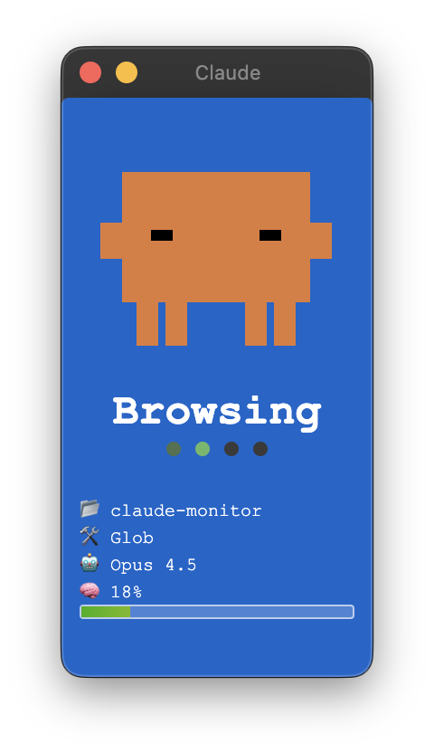

# Vibe Monitor

Real-time status and usage monitor for AI coding assistants with pixel art character.

Monitor your **Claude Code** or **Kiro IDE** sessions at a glance - see what state it's in, which project and tool it's using, what model is active, and how much context memory is consumed.

## What It Monitors

| Field | Description | Example |
|-------|-------------|---------|
| **State** | Current Claude Code activity state | `working`, `idle`, `notification` |
| **Project** | Active project directory name | `vibe-monitor` |
| **Tool** | Currently executing tool | `Bash`, `Read`, `Edit` |
| **Model** | Active Claude model | `Opus 4.5`, `Sonnet` |
| **Memory** | Context window usage percentage | `45%` |

## Platforms

| Platform | Description | Best For |
|----------|-------------|----------|
| **Desktop App** | Electron app with system tray | Daily use, always-visible monitoring |
| **ESP32 Hardware** | Dedicated LCD display device | Desk companion, hardware enthusiasts |
| **Web Simulator** | Browser-based preview | Testing, development, no installation |

## Preview



```
┌────────────────────┐
│                    │
│    ┌──────────┐    │
│    │██████████│    │
│  ██│█ ■    ■ █│██  │  ← Claude character
│    │██████████│    │     (128x128 pixels)
│    └─┬─┬──┬─┬─┘    │
│      │█│  │█│      │
├────────────────────┤
│     Working        │  ← Status text
│     ● ● ● ○        │  ← Loading animation
├────────────────────┤
│ 📂 my-project      │  ← Project name
│ 🛠️ Bash            │  ← Current tool
│ 🤖 Opus 4.5        │  ← Model
│ 🧠 45%             │  ← Memory usage
│ ████████░░░░░░░░░░ │  ← Memory bar (gradient)
└────────────────────┘
```

## Quick Start

### Desktop App

```bash
cd desktop
npm install
npm start
```

The app runs in the system tray and listens on `http://127.0.0.1:19280`.

### Web Simulator

No installation required - just open in browser:

**Online**: https://nalbam.github.io/vibe-monitor/simulator/

**Local**:
```bash
open simulator/index.html
```

### ESP32 Hardware

See [ESP32 Setup](#esp32-setup) section below.

## IDE Integration

Vibe Monitor integrates with AI coding assistants through hooks.

### Supported IDEs

| IDE | Hook System |
|-----|-------------|
| **Claude Code** | Shell hooks via `settings.json` |
| **Kiro IDE/CLI** | Agent hooks via `config/kiro/hooks/` |

### How It Works

```
AI IDE → Hooks → Vibe Monitor
   │                   │
   └── Events ───────→ Display
       (state, tool,   (Desktop App,
        project, etc.)  ESP32, or both)
```

---

### Claude Code Setup

Claude Code uses shell hooks defined in `settings.json`.

#### 1. Copy hook script

```bash
cp config/claude/hooks/vibe-monitor.sh ~/.claude/hooks/
chmod +x ~/.claude/hooks/vibe-monitor.sh
```

#### 2. Configure environment variables

Choose **one** of the following options:

**Option A: Copy to config folder (recommended)**

The hook script automatically loads `~/.claude/.env.local`:

```bash
cp config/claude/.env.sample ~/.claude/.env.local
# Edit the file and set your values
```

**Option B: Source from shell profile**

Add to `~/.zshrc` or `~/.bashrc`:

```bash
if [ -f ~/.claude/.env.local ]; then
  source ~/.claude/.env.local
fi
```

Then copy the sample file:

```bash
cp config/claude/.env.sample ~/.claude/.env.local
```

#### 3. Edit `~/.claude/.env.local`

```bash
# Desktop App path (auto-launches on SessionStart if not running)
export VIBE_MONITOR_DESKTOP="~/vibe-monitor/desktop"

# Desktop App URL (sends status updates)
export VIBE_MONITOR_URL="http://127.0.0.1:19280"

# ESP32 USB Serial port (optional)
export ESP32_SERIAL_PORT="/dev/cu.usbmodem1101"

# ESP32 WiFi HTTP (optional)
# export ESP32_HTTP_URL="http://192.168.1.100"
```

> **Note:** Character is auto-detected (Claude Code → `clawd`)

#### 4. Register hook in `~/.claude/settings.json`

```json
{
  "hooks": {
    "SessionStart": [{ "command": "~/.claude/hooks/vibe-monitor.sh" }],
    "UserPromptSubmit": [{ "command": "~/.claude/hooks/vibe-monitor.sh" }],
    "PreToolUse": [{ "command": "~/.claude/hooks/vibe-monitor.sh" }],
    "PostToolUse": [{ "command": "~/.claude/hooks/vibe-monitor.sh" }],
    "Notification": [{ "command": "~/.claude/hooks/vibe-monitor.sh" }],
    "Stop": [{ "command": "~/.claude/hooks/vibe-monitor.sh" }]
  }
}
```

#### 5. Statusline (Optional)

Claude Code statusline shows project, model, and memory usage:

```
📂 vibe-monitor │ 🤖 Opus 4.5 │ 🧠 ━━━━━━━━╌╌ 80%
```

Add to `~/.claude/settings.json`:

```json
{
  "statusline": {
    "command": "~/.claude/statusline.sh"
  }
}
```

Copy the script:

```bash
cp config/claude/statusline.sh ~/.claude/statusline.sh
chmod +x ~/.claude/statusline.sh
```

**Data Source:**
- `📂 Project` ← `.workspace.current_dir`
- `🤖 Model` ← `.model.display_name`
- `🧠 Memory` ← `.context_window.used_percentage`

#### Claude Code Hook Events

| Event | Vibe Monitor State | Description |
|-------|-------------------|-------------|
| `SessionStart` | `start` | Session begins |
| `UserPromptSubmit` | `thinking` | User submits prompt, AI starts thinking |
| `PreToolUse` | `working` | Tool execution starts |
| `PostToolUse` | `done` | *(Currently disabled)* |
| `Notification` | `notification` | User input needed |
| `Stop` | `idle` | Agent turn ends |

---

### Kiro IDE Setup

Kiro IDE uses `.kiro.hook` files for agent event hooks.

#### 1. Copy hook files

```bash
mkdir -p ~/.kiro/hooks
cp config/kiro/hooks/*.kiro.hook ~/.kiro/hooks/
```

> **Note:** Character is auto-set to `kiro` in the hook files.

#### Kiro Hook Events

| Hook File | Event | State | Description |
|-----------|-------|-------|-------------|
| `vibe-monitor-agent-spawn.kiro.hook` | `agentSpawn` | `start` | Agent activated |
| `vibe-monitor-prompt-submit.kiro.hook` | `promptSubmit` | `working` | User submits prompt |
| `vibe-monitor-pre-tool-use.kiro.hook` | `preToolUse` | `working` | Tool execution starts |
| `vibe-monitor-agent-stop.kiro.hook` | `agentStop` | `idle` | Agent turn ends |

#### Available Kiro Event Types

`agentSpawn`, `promptSubmit`, `preToolUse`, `postToolUse`, `agentStop`, `fileCreated`, `fileSaved`, `fileDeleted`

---

### Hook Priority

The hook sends status updates in order (only if configured):
1. **Desktop App** - if `VIBE_MONITOR_URL` is set (auto-launches via `VIBE_MONITOR_DESKTOP`)
2. **ESP32 USB Serial** - if `ESP32_SERIAL_PORT` is set
3. **ESP32 HTTP** - if `ESP32_HTTP_URL` is set

---

### Event Mapping Comparison

| Action | Claude Code | Kiro IDE |
|--------|-------------|----------|
| Session start | `SessionStart` | `agentSpawn` |
| User input | `UserPromptSubmit` | `promptSubmit` |
| Before tool | `PreToolUse` | `preToolUse` |
| After tool | `PostToolUse` | `postToolUse` |
| Agent done | `Stop` | `agentStop` |
| Notification | `Notification` | - |

## Characters

| Character | Color | Description | Auto-selected for |
|-----------|-------|-------------|-------------------|
| `clawd` | Orange | Default character with arms and legs | Claude Code |
| `kiro` | White | Ghost character with wavy tail | Kiro IDE/CLI |

Character is **auto-detected** based on the IDE hook events. You can also manually change it via the system tray menu.

## State Display

| State | Background | Eyes | Text | Trigger |
|-------|------------|------|------|---------|
| `start` | Cyan | ■ ■ + ✦ | Hello! | Session begins |
| `idle` | Green | ■ ■ | Ready | Waiting for input |
| `thinking` | Purple | ▀ ▀ + 💭 | Thinking | User submits prompt |
| `working` | Blue | ▬ ▬ | (tool-based) | Tool executing |
| `notification` | Yellow | ● ● + ? | Input? | User input needed |
| `done` | Green | ∨ ∨ | Done! | Tool completed |
| `sleep` | Navy | ─ ─ + Z | Zzz... | 10min inactivity |

### Working State Text

The `working` state displays context-aware text based on the active tool:

| Tool | Possible Text |
|------|---------------|
| Bash | Running, Executing, Processing |
| Read | Reading, Scanning, Checking |
| Edit | Editing, Modifying, Fixing |
| Write | Writing, Creating, Saving |
| Grep | Searching, Finding, Looking |
| Glob | Scanning, Browsing, Finding |
| Task | Thinking, Working, Planning |
| WebFetch | Fetching, Loading, Getting |
| WebSearch | Searching, Googling, Looking |
| Default | Working, Busy, Coding |

### Animations

- **Floating**: All states have gentle floating motion (±3px horizontal, ±5px vertical, ~3.2s cycle)
- **Blink**: Idle state blinks every 3 seconds
- **Loading dots**: Working state shows animated progress dots
- **Sparkle**: Session start shows rotating sparkle effect
- **Zzz**: Sleep state shows blinking Z animation

### Sleep Mode

Automatically transitions to `sleep` after 10 minutes of inactivity from `start`, `idle` or `done`. Any new status update wakes the display.

## HTTP API

Both Desktop App (port 19280) and ESP32 WiFi mode (port 80) support the same API.

### POST /status

Update monitor status.

```bash
curl -X POST http://127.0.0.1:19280/status \
  -H "Content-Type: application/json" \
  -d '{"state":"working","tool":"Bash","project":"my-project","model":"opus","memory":"45%"}'
```

**Request Body:**
```json
{
  "state": "working",
  "event": "PreToolUse",
  "tool": "Bash",
  "project": "my-project",
  "model": "opus",
  "memory": "45%",
  "character": "clawd"
}
```

### GET /status

Get current status.

```bash
curl http://127.0.0.1:19280/status
```

**Response:**
```json
{
  "state": "working",
  "project": "my-project",
  "tool": "Bash",
  "model": "opus",
  "memory": "45%"
}
```

### GET /health

Health check endpoint.

```bash
curl http://127.0.0.1:19280/health
```

### POST /show (Desktop only)

Show window and position to top-right corner.

```bash
curl -X POST http://127.0.0.1:19280/show
```

### GET /debug (Desktop only)

Get display and window debug information.

```bash
curl http://127.0.0.1:19280/debug
```

## Desktop App

### Features

- **Frameless window**: Clean floating design
- **Always on Top**: Stays visible above other windows
- **System Tray**: Quick access from menubar/taskbar
- **Platform icons**: Emoji on macOS, pixel art on Windows/Linux
- **Draggable**: Move window anywhere on screen

### System Tray Menu

- View current state
- Manually change state
- Toggle Always on Top
- Show/Hide window
- Quit application

### Build

```bash
cd desktop

# macOS
npm run build:mac

# Windows
npm run build:win

# Linux
npm run build:linux

# All platforms
npm run build:all
```

See [desktop/README.md](desktop/README.md) for WSL setup and troubleshooting.

## ESP32 Setup

### Hardware

- **Board**: ESP32-C6-LCD-1.47 (172x320, ST7789V2)
- **Connection**: USB-C (Serial) or WiFi

### Arduino IDE Setup

1. **Add ESP32 Board Manager**
   - File → Preferences → Additional Board Manager URLs:
   - `https://raw.githubusercontent.com/espressif/arduino-esp32/gh-pages/package_esp32_index.json`

2. **Install ESP32 Board**
   - Tools → Board → Boards Manager → Search "esp32" → Install

3. **Install Libraries**
   - Tools → Manage Libraries:
   - `TFT_eSPI` by Bodmer
   - `ArduinoJson` by Benoit Blanchon

4. **Configure TFT_eSPI**
   - Copy `User_Setup.h` to Arduino library folder:
   - `cp User_Setup.h ~/Documents/Arduino/libraries/TFT_eSPI/User_Setup.h`

5. **Upload**
   - Tools → Board → ESP32C6 Dev Module
   - Tools → Port → /dev/cu.usbmodem* (or appropriate port)
   - Click Upload

### WiFi Mode (Optional)

Edit `vibe-monitor.ino`:

```cpp
#define USE_WIFI
const char* ssid = "YOUR_SSID";
const char* password = "YOUR_PASSWORD";
```

### Serial Port Check

```bash
# macOS
ls /dev/cu.*

# Linux
ls /dev/ttyUSB* /dev/ttyACM*
```

### Testing

```bash
# Test working state
echo '{"state":"working","tool":"Bash","project":"test","model":"opus","memory":"50%"}' > /dev/cu.usbmodem1101

# Test idle state
echo '{"state":"idle","project":"test","model":"opus","memory":"45%"}' > /dev/cu.usbmodem1101
```

## Troubleshooting

### Desktop App

| Issue | Solution |
|-------|----------|
| Window not appearing | Check system tray for app icon, or run `curl -X POST http://127.0.0.1:19280/show` |
| Port already in use | Another instance may be running. Check with `lsof -i :19280` |

### ESP32

| Issue | Solution |
|-------|----------|
| Display not working | Verify `User_Setup.h` is copied to TFT_eSPI library folder |
| Serial connection failed | Check port permissions: `sudo chmod 666 /dev/ttyUSB0` |
| JSON parsing error | Ensure JSON ends with LF (`\n`) |

## File Structure

```
vibe-monitor/
├── README.md                   # This document
├── CLAUDE.md                   # AI development guidelines
├── vibe-monitor.ino            # ESP32 main firmware
├── sprites.h                   # Character rendering (ESP32)
├── User_Setup.h                # TFT display configuration
├── config/                     # IDE configuration files
│   ├── claude/                 # Claude Code settings
│   │   ├── .env.sample         # Environment variables sample
│   │   ├── settings.json       # Hook configuration example
│   │   ├── statusline.sh       # Statusline script (model, memory)
│   │   └── hooks/              # Hook scripts
│   │       └── vibe-monitor.sh # Main hook script
│   └── kiro/                   # Kiro IDE settings
│       └── hooks/              # Hook files
│           ├── vibe-monitor-agent-spawn.kiro.hook
│           ├── vibe-monitor-prompt-submit.kiro.hook
│           ├── vibe-monitor-pre-tool-use.kiro.hook
│           └── vibe-monitor-agent-stop.kiro.hook
├── shared/                     # Shared code (Desktop/Simulator)
│   ├── config.js               # State/character configuration
│   ├── character.js            # Character rendering logic
│   ├── sprites.js              # Sprite definitions
│   ├── effects.js              # Visual effects
│   ├── icons.js                # Icon rendering
│   └── utils.js                # Utility functions
├── desktop/                    # Desktop app
│   ├── main.js                 # Electron main process
│   ├── index.html              # Renderer
│   ├── preload.js              # IPC bridge
│   ├── package.json            # Dependencies
│   ├── README.md               # Desktop-specific docs
│   └── assets/                 # App icons
└── simulator/                  # Web simulator
    ├── index.html              # Browser UI
    └── app.js                  # Simulator logic
```

## Version History

- **v2.1**: Desktop app with system tray, memory bar gradient
- **v2.0**: Pixel art character (128x128), web simulator
- **v1.0**: Circular status display
